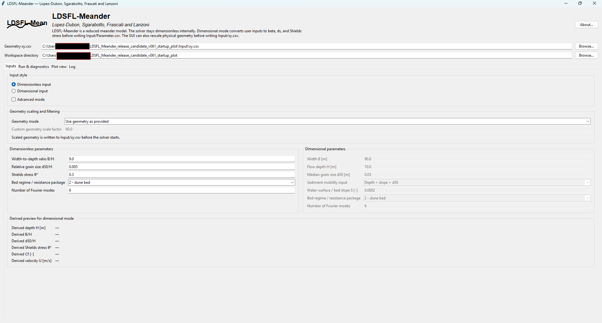
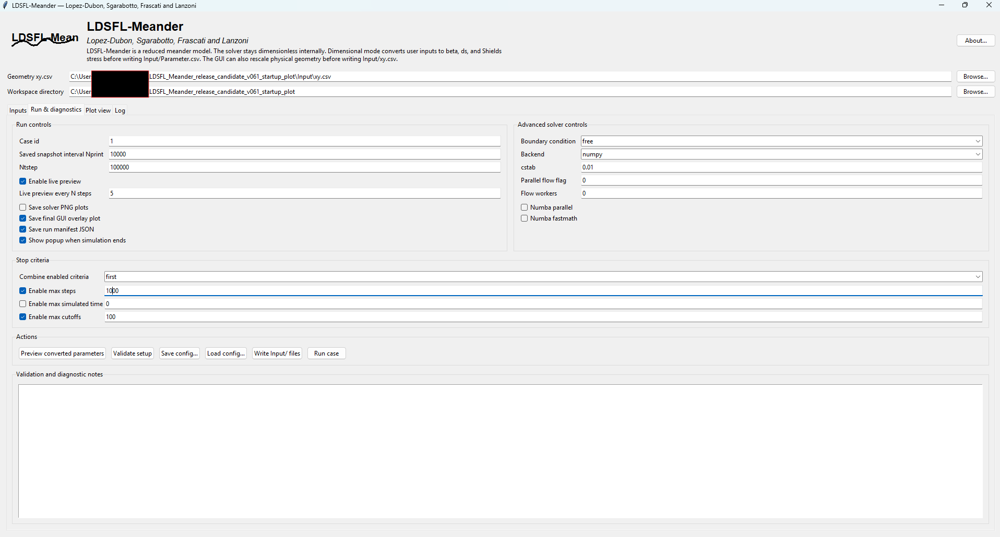

<p align="center">
  
</p>

<h1 align="center">LDSFL-Meander</h1>

<p align="center">
  <strong>A reduced morphodynamic model for meandering rivers</strong><br>
  Lopez-Dubon, Sgarabotto, Frascati and Lanzoni
</p>

<p align="center">
  <a href="https://doi.org/10.5281/zenodo.19945291"></a>
  
  = 3.10">
  
  
</p>

<p align="center">
  <a href="#quick-start">Quick start</a> •
  <a href="#screenshots-and-example-output">Screenshots</a> •
  <a href="#sinuosity-stability-diagnostics">Sinuosity diagnostics</a> •
  <a href="#citation">Citation</a> •
  <a href="docs/LDSFL_Meander_user_manual.pdf">User manual</a>
</p>

---

## Overview

**LDSFL-Meander** is a Python implementation of a reduced meander-morphodynamics model. It provides both a command-line workflow and a desktop graphical interface for setting up, running, and inspecting reproducible simulations of river-centerline evolution.

The package includes:

- a solver package in [`ldsfl/`](ldsfl/),
- a command-line runner, [`run_ldsfl.py`](run_ldsfl.py),
- a desktop GUI, [`gui_ldsfl.py`](gui_ldsfl.py),
- bundled example inputs in [`Input/`](Input/),
- smoke tests for quick verification,
- a full PDF manual in [`docs/LDSFL_Meander_user_manual.pdf`](docs/LDSFL_Meander_user_manual.pdf),
- step-vs-sinuosity diagnostics for checking stable or quasi-stable planform evolution.

Version **v0.6.5** keeps the v0.6.4 sinuosity diagnostic and adds a more usable GUI workflow: scrollable input/diagnostics tabs, a graceful **Stop after current step** button, and a **Continue from latest output** button for extending a run after a stop criterion or manual stop.

---

## Scope and limitations

LDSFL-Meander is intended for reduced-model studies of meander evolution, especially for **wide, mildly curved, long bends**.

It is **not** a full 2D or 3D hydrodynamic solver. It should not be presented as a sharp-bend separation model or as a replacement for RANS/LES or full morphodynamic simulations.

Use the model as a fast research and teaching tool for exploring reduced meander dynamics, testing sensitivity to input parameters, and preparing reproducible planform-evolution experiments.

---

## Screenshots and example output

| GUI input panel | GUI plot view |
|---|---|
|  |  |

| Run diagnostics | Example sinuosity history |
|---|---|
|  |  |

---

## Main features

| Area | What is included |
|---|---|
| Solver | Reduced meander-morphodynamics solver in the `ldsfl` package |
| Interfaces | Command-line runner and Tkinter desktop GUI |
| Inputs | Dimensionless inputs or dimensional-to-dimensionless conversion |
| Geometry | Centerline import, validation, optional rescaling by reference half-width `B_0` |
| Friction and transport | Multiple friction and Shields-stress input routes through the GUI |
| Outputs | Planform snapshots, variable histories, centerline/velocity CSV files, plots |
| Diagnostics | Step-vs-sinuosity history, stable/quasi-stable status, relative span and trend metrics |
| GUI controls | Scrollable tabs, graceful user stop, and continuation from the latest saved geometry |
| Reproducibility | Bundled example input, expected output metadata, smoke tests, citation metadata |

---

## Important notation

The public documentation and GUI use the following notation.

| Symbol or field | Meaning |
|---|---|
| `B_0` | Reference channel **half-width** |
| `2B_0` | Full reference channel width |
| `D_0` | Reference flow depth used in dimensional input conversion |
| `Beta` | Reduced width ratio, `Beta = B_0 / D_0` |
| `ds` | Relative sediment size, `ds = d50 / D_0` |
| `Thetha` | Historical CSV spelling for reference Shields stress `theta_0` |
| `kappa(s)` | Curvature notation used in the manual |
| `D(s,n)` | Reserved for a future local depth field |
| `h(s,n)` | Reserved for a future free-surface elevation field |

The code keeps some historical input-field names for backward compatibility, but the manual and GUI labels clarify the current notation.

---

## Repository layout

```text
LDSFL_Meander/
├── Input/                              # bundled example input files
│   ├── Parameter.csv
│   └── xy.csv
├── docs/                               # LaTeX manual, PDF manual, figures
│   ├── LDSFL_Meander_user_manual.pdf
│   ├── LDSFL_Meander_user_manual.tex
│   └── figures/
├── examples/
│   └── reproducible_case1_short/       # small reproducible example metadata
├── ldsfl/                              # solver package
├── gui_ldsfl.py                        # desktop GUI
├── run_ldsfl.py                        # command-line runner
├── smoke_test.py                       # solver smoke test
├── gui_smoke_test.py                   # GUI/config smoke test
├── USER_MANUAL.md                      # short Markdown guide
├── CITATION.cff                        # citation metadata
├── LICENSE
└── README.md
```

---

## Quick start

### 1. Create and activate an environment

```bash
python -m venv .venv
```

On Windows Command Prompt:

```bat
.venv\Scripts\activate
```

On macOS/Linux:

```bash
source .venv/bin/activate
```

### 2. Install dependencies

```bash
pip install -r requirements.txt
```

### 3. Run the smoke tests

```bash
python smoke_test.py
python gui_smoke_test.py
```

### 4. Run the bundled example from the command line

```bash
python run_ldsfl.py --base-dir . --cases 1 --max-steps 50 --nprint 10
```

To run without generating planform PNG files:

```bash
python run_ldsfl.py --base-dir . --cases 1 --max-steps 50 --nprint 10 --no-plots
```

### 5. Launch the GUI

```bash
python gui_ldsfl.py
```

On startup, the GUI preloads the bundled example geometry and parameter values from [`Input/`](Input/), so a first trial run can be launched immediately.

---

## GUI workflow

The GUI can be used to:

1. choose dimensionless or dimensional input mode,
2. load and validate a centerline file,
3. keep geometry as provided or rescale it by `B_0`,
4. preview converted reduced parameters,
5. choose stop criteria and solver backend options,
6. choose dimensional or dimensionless output units,
7. run the simulation,
8. inspect the final planform overlay,
9. check the step-vs-sinuosity stability diagnostic.

The GUI is intended for interactive setup and teaching. For batch work and scripted reproducibility, use [`run_ldsfl.py`](run_ldsfl.py).

---


## GUI stop and continuation controls

The GUI includes two run-control buttons for longer experiments:

- **Stop after current step** requests a graceful stop. The solver stops at the next safe iteration boundary and writes the final geometry/sinuosity files.
- **Continue from latest output** starts a new continuation run using the latest saved `xyu` geometry as the next initial centerline. This is useful when a run reaches `max_steps`, `max_cutoffs`, or another stop criterion but the planform is not yet stable.

For continuation runs, the GUI writes an intermediate file named `Input/xy_continue_from_latest.csv` and then starts a new solver segment with the same model parameters. If dimensional outputs were selected, the GUI converts the latest saved coordinates back to solver units before continuing.

## Sinuosity stability diagnostics

Version **v0.6.5** includes a step-vs-sinuosity diagnostic to help identify whether the planform has become stable or quasi-stable.

Each run writes:

```text
Output/<id_files>/files/sinuosity_history_<id_files>.csv
Output/<id_files>/plot/sinuosity_history_<id_files>.png
```

The diagnostic uses a moving window of stored sinuosity values. The default window is **100 values**. It reports:

- final sinuosity,
- relative span over the selected window,
- relative trend per step,
- qualitative state: `not stable`, `quasi-stable`, or `stable`.

This is a diagnostic indicator, not a proof of physical equilibrium. A quasi-stable sinuosity curve should still be interpreted together with the final planform, cutoff history, and model assumptions.

---

## Output folders

A run creates an `Output/<id_files>/` folder with subfolders such as:

```text
Output/<id_files>/
├── files/      # variable histories and sinuosity history CSV
├── plot/       # planform plots and sinuosity history plot
├── xyu/        # centerline, angle, curvature, velocity snapshots
└── xy_cut/     # cutoff geometry segments when cutoffs occur
```

The exact `<id_files>` name is generated from the case index and reduced input parameters.

---

## Command-line options

Show available command-line options with:

```bash
python run_ldsfl.py --help
```

Common options include:

```bash
python run_ldsfl.py --base-dir . --cases 1 --max-steps 1000 --nprint 100
python run_ldsfl.py --base-dir . --cases 1 --max-steps 1000 --no-plots
python run_ldsfl.py --base-dir . --cases 1 --flow-backend numpy
```

---

## Documentation

The full user manual is available here:

- [`docs/LDSFL_Meander_user_manual.pdf`](docs/LDSFL_Meander_user_manual.pdf)
- [`docs/LDSFL_Meander_user_manual.tex`](docs/LDSFL_Meander_user_manual.tex)

A shorter Markdown guide is available here:

- [`USER_MANUAL.md`](USER_MANUAL.md)

---

## Citation

For the evolving software project, cite the Zenodo concept DOI:

```text
10.5281/zenodo.19945291
```

For an exact archived release, cite the release-specific Zenodo DOI shown on the relevant Zenodo version page.

The repository also includes [`CITATION.cff`](CITATION.cff), which GitHub can use to generate citation text.

---

## License

This project is distributed under the MIT License. See [`LICENSE`](LICENSE).

---

## Authors

LDSFL-Meander is named after and authored by:

- Sergio Lopez-Dubon
- Leonardo Sgarabotto
- Alessandro Frascati
- Stefano Lanzoni

---

## Recommended release workflow

For GitHub and Zenodo releases:

1. update source files and documentation,
2. run the smoke tests,
3. commit and push to GitHub,
4. create a GitHub release,
5. let Zenodo archive the release and mint a version DOI,
6. use the Zenodo concept DOI for the project and the version DOI for exact reproducibility.
