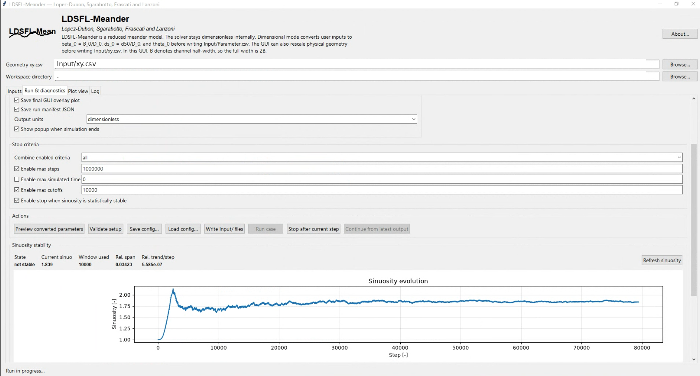

<p align="center">
  
</p>

<h1 align="center">LDSFL-Meander</h1>

<p align="center">
  <strong>Reduced morphodynamic modelling for meandering-river centreline evolution</strong><br>
  Lopez-Dubon, Sgarabotto, Frascati and Lanzoni
</p>

<p align="center">
  <a href="https://doi.org/10.5281/zenodo.19945291"></a>
  <a href="https://github.com/sergioald/LDSFL_Meander/actions/workflows/tests.yml"></a>
  
  = 3.10">
  
  
</p>

<p align="center">
  <a href="#overview">Overview</a> •
  <a href="#visual-overview">Visual overview</a> •
  <a href="#installation">Installation</a> •
  <a href="#run-the-bundled-example">Run example</a> •
  <a href="#validation-and-reproducibility">Validation</a> •
  <a href="#citation">Citation</a>
</p>

---

## Overview

**LDSFL-Meander** is a Python research-software implementation of a reduced morphodynamic model for meandering river-centreline evolution.

The repository combines:

- a **reduced meander-morphodynamics solver** in reusable Python modules;
- **transparent CSV-based inputs** for reproducible model configuration;
- a **command-line runner** for batch experiments and regression-style checks;
- a **local Tkinter + Matplotlib GUI** for interactive setup, monitoring and teaching;
- **step-vs-sinuosity diagnostics** for identifying stable or quasi-stable planform behaviour;
- lightweight tests, CI and citation metadata suitable for public research-software use.

The model is intended for fast exploratory studies of reduced meander dynamics, sensitivity to model parameters, and research/portfolio demonstration of scientific Python workflows.

---

## Scientific scope

LDSFL-Meander is intended for **wide, mildly curved, long-bend reduced-model studies**.

It should be interpreted as a fast reduced model, not as a full two-dimensional or three-dimensional hydrodynamic solver. It is **not** a replacement for RANS, LES, Delft3D, TELEMAC or full morphodynamic simulations.

Use it to explore reduced centreline dynamics, compare parameter choices, inspect stability trends, and support teaching or research-software demonstrations. For operational engineering or publication-quality interpretation, outputs should be checked against the model assumptions, input quality and independent hydraulic or geomorphic evidence.

---

## Software implementation

This repository is a cleaned, reusable research-software implementation of the LDSFL meander-evolution workflows.

The implementation includes:

- modular solver code in [`ldsfl/`](ldsfl/);
- command-line execution through [`run_ldsfl.py`](run_ldsfl.py) and the installed `ldsfl-run` command;
- local GUI execution through [`gui_ldsfl.py`](gui_ldsfl.py);
- bundled example inputs in [`Input/`](Input/);
- reproducible output folders under `Output/<id_files>/`;
- GUI and solver stability diagnostics based on sinuosity histories;
- lightweight unit and integration tests in [`tests/`](tests/);
- GitHub Actions checks across supported Python versions;
- software citation metadata through Zenodo and [`CITATION.cff`](CITATION.cff).

Generated outputs are intentionally not treated as source files. New simulations should write to `Output/`, and users should keep large run products out of Git unless they are small, documented example artefacts.

---

## Visual overview

### GUI run setup and sinuosity-stability diagnostics

<p align="center">
  
</p>

The GUI supports dimensional and dimensionless setup, run controls, stop criteria, live plotting and step-vs-sinuosity diagnostics. The screenshot uses repository-relative paths so it can be safely included in the public README.

---

## Installation

### Option A: Conda environment

```bash
conda create -n ldsfl-meander python=3.10 -y
conda activate ldsfl-meander
python -m pip install --upgrade pip
python -m pip install -e ".[dev]"
```

### Option B: Windows PowerShell virtual environment

```powershell
python -m venv .venv
.\.venv\Scripts\Activate.ps1
python -m pip install --upgrade pip
python -m pip install -e ".[dev]"
```

### Option C: macOS/Linux virtual environment

```bash
python -m venv .venv
source .venv/bin/activate
python -m pip install --upgrade pip
python -m pip install -e ".[dev]"
```

Check the installation:

```bash
python -m pytest
```

Optional acceleration dependencies can be installed with:

```bash
python -m pip install -e ".[numba]"
```

---

## Run the bundled example

Run a short command-line example:

```bash
ldsfl-run --base-dir . --cases 1 --max-steps 50 --nprint 10 --no-plots
```

Equivalent direct-script form:

```bash
python run_ldsfl.py --base-dir . --cases 1 --max-steps 50 --nprint 10 --no-plots
```

Run with plots enabled:

```bash
python run_ldsfl.py --base-dir . --cases 1 --max-steps 50 --nprint 10
```

Launch the GUI:

```bash
python gui_ldsfl.py
```

On startup, the GUI preloads the bundled example inputs from [`Input/`](Input/), so a first run can be launched immediately.

---

## Inputs and outputs

### Main input files

The bundled example uses CSV files under [`Input/`](Input/), including:

- [`Input/Parameter.csv`](Input/Parameter.csv) for model and run parameters;
- [`Input/xy.csv`](Input/xy.csv) for input centreline coordinates.

### Typical output structure

A run writes outputs under:

```text
Output/<id_files>/
├── files/      # variable histories and sinuosity history CSV
├── plot/       # planform and sinuosity plots
├── xyu/        # centreline, angle, curvature and velocity snapshots
└── xy_cut/     # cutoff geometry segments, when cutoffs occur
```

Generated output folders are useful for reproducibility checks, diagnostics and figure generation, but should not usually be committed to the repository.

---

## Interfaces

| Interface | Best for | Command/file |
|---|---|---|
| Python package | Reusing solver functions in scripts | [`ldsfl/`](ldsfl/) |
| Command line | Reproducible batch runs | `ldsfl-run --help` or `python run_ldsfl.py --help` |
| Desktop GUI | Interactive setup, teaching and visual inspection | `python gui_ldsfl.py` |
| Input CSV files | Transparent reproducible configuration | [`Input/Parameter.csv`](Input/Parameter.csv), [`Input/xy.csv`](Input/xy.csv) |

---

## Stability diagnostics

The solver records step-vs-sinuosity histories and reports stability metrics for exploratory runs.

Recent diagnostics include:

- moving-window sinuosity state;
- relative span and trend per step;
- slope-equivalence stability testing;
- optional stopping once sinuosity is statistically stable.

The stability criterion is intended to identify practical convergence of **bulk sinuosity**, not to prove that every bend has reached a mathematical equilibrium. It should be interpreted together with planform plots, cutoff behaviour, curvature evolution and the selected model assumptions.

---

## Repository structure

```text
ldsfl/                       Core solver package
gui_ldsfl.py                 Tkinter + Matplotlib desktop GUI
run_ldsfl.py                 Command-line runner
Input/                       Bundled example input files
Output/                      Generated run outputs, usually ignored by Git
examples/                    Small example metadata and reproducibility notes
tests/                       Unit and integration tests
docs/                        Manuals, figures, portfolio and validation notes
CITATION.cff                 Machine-readable citation metadata
pyproject.toml               Package metadata, dependencies and tool settings
```

---

## Validation and reproducibility

Recommended checks before release or publication use:

```bash
python -m pytest
python -m ruff check ldsfl run_ldsfl.py tests
python -m run_ldsfl --base-dir . --cases 1 --max-steps 1 --no-plots
```

For a clearer description of what is and is not validated in this public repository, see [`docs/validation_notes.md`](docs/validation_notes.md).

The repository is intended for **local reproducible reduced-model analysis**. Generated outputs, long-run products and large diagnostic files should normally remain outside Git unless they are intentionally curated as small examples.

---

## Documentation

- [CLI usage guide](docs/cli_usage.md)
- [macOS GUI and plotting notes](docs/macos_gui_notes.md)
- [Timestep and iteration notes](docs/timestep_notes.md)

- [User manual PDF](docs/LDSFL_Meander_user_manual.pdf)
- [User manual source](docs/LDSFL_Meander_user_manual.tex)
- [Short Markdown guide](USER_MANUAL.md)
- [Portfolio summary](docs/portfolio_summary.md)
- [Validation notes](docs/validation_notes.md)

The main README is intentionally concise. Detailed modelling assumptions, workflow notes and portfolio context are kept in the documentation files under [`docs/`](docs/).

---

## Citation

For the evolving software project, cite the Zenodo concept DOI:

```text
10.5281/zenodo.19945291
```

For an exact archived release, cite the release-specific Zenodo DOI shown on the relevant Zenodo version page.

GitHub can also generate citation text from [`CITATION.cff`](CITATION.cff).

---

## License

This project is distributed under the **MIT License**. See [`LICENSE`](LICENSE).

---

## Authors

LDSFL-Meander is named after and authored by:

- Sergio Lopez-Dubon
- Alessandro Sgarabotto
- Alessandro Frascati
- Stefano Lanzoni\n\n## Documentation\n\n- [Theory-to-code mapping](docs/theory_code_mapping.md)\n- [Validation strategy and known limitations](docs/validation_strategy.md)\n\n