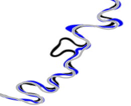
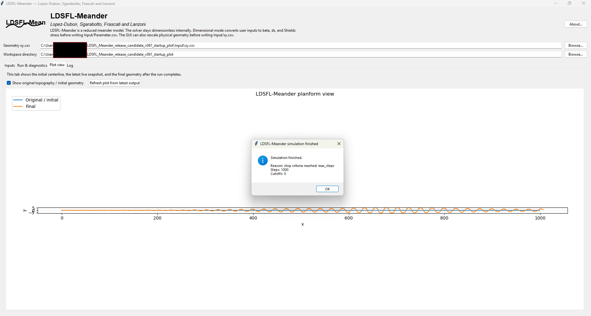
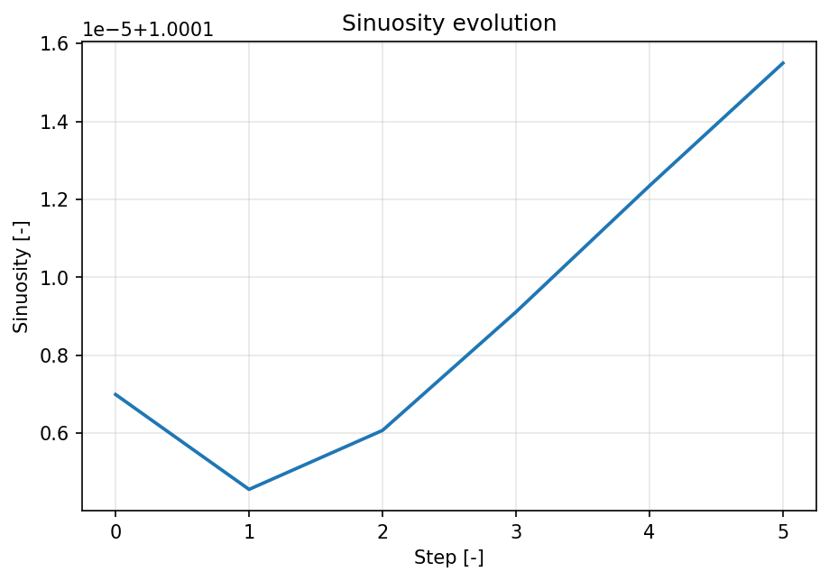

<p align="center">
  
</p>

<h1 align="center">LDSFL-Meander</h1>

<p align="center">
  <strong>A reduced morphodynamic model for meandering rivers</strong><br>
  Lopez-Dubon, Sgarabotto, Frascati and Lanzoni
</p>

<p align="center">
  <a href="https://doi.org/10.5281/zenodo.19945291"></a>
  
  = 3.10">
  
  
</p>

<p align="center">
  <a href="#visual-overview">Visual overview</a> •
  <a href="#quick-start">Quick start</a> •
  <a href="#reproduce-the-bundled-example">Reproduce example</a> •
  <a href="#interfaces">Interfaces</a> •
  <a href="#documentation">Documentation</a> •
  <a href="#citation">Citation</a>
</p>

---

## What this is

**LDSFL-Meander** is a Python research-software implementation of a reduced morphodynamic model for meandering river-centerline evolution. It provides a solver package, a command-line runner, and a desktop GUI for setting up, running, and inspecting reproducible meander simulations.

The repository is designed for:

- reduced-model studies of meander evolution,
- reproducible command-line experiments,
- interactive GUI-based teaching and exploration,
- portfolio/research demonstration of scientific Python software.

## What this model is — and is not

LDSFL-Meander is intended for **wide, mildly curved, long-bend** reduced-model studies.

It is **not** a full 2D or 3D hydrodynamic solver, and it should not be presented as a replacement for RANS, LES, Delft3D, TELEMAC, or full morphodynamic simulations. Use it as a fast research and teaching tool for exploring reduced meander dynamics and sensitivity to model parameters.

---

## Visual overview

| Planform GUI view | Sinuosity diagnostic |
|---|---|
|  |  |

LDSFL-Meander evolves an input centerline, writes reproducible output snapshots, and reports step-vs-sinuosity diagnostics to help identify stable or quasi-stable planform behaviour.

---

## Repository contents

| Area | What is included |
|---|---|
| Solver | Reduced meander-morphodynamics solver in [`ldsfl/`](ldsfl/) |
| CLI | Batch/reproducible runner in [`run_ldsfl.py`](run_ldsfl.py) |
| GUI | Tkinter + Matplotlib desktop interface in [`gui_ldsfl.py`](gui_ldsfl.py) |
| Inputs | Bundled example files in [`Input/`](Input/) |
| Examples | Reproducible short-case metadata in [`examples/`](examples/) |
| Documentation | PDF manual, Markdown guide, and portfolio summary in [`docs/`](docs/) |
| Tests | Pytest-based unit and integration tests in [`tests/`](tests/) |

---

## Quick start

### Windows PowerShell

```powershell
python -m venv .venv
.\.venv\Scripts\Activate.ps1
python -m pip install --upgrade pip
python -m pip install -e ".[dev]"
python -m pytest
```

### macOS/Linux

```bash
python -m venv .venv
source .venv/bin/activate
python -m pip install --upgrade pip
python -m pip install -e ".[dev]"
python -m pytest
```

### Conda users

```powershell
conda create -n ldsfl-meander python=3.10
conda activate ldsfl-meander
python -m pip install --upgrade pip
python -m pip install -e ".[dev]"
python -m pytest
```

---

## Reproduce the bundled example

Run a short example from the command line:

```bash
python run_ldsfl.py --base-dir . --cases 1 --max-steps 50 --nprint 10 --no-plots
```

Run the same example with plots enabled:

```bash
python run_ldsfl.py --base-dir . --cases 1 --max-steps 50 --nprint 10
```

A run writes outputs under:

```text
Output/<id_files>/
├── files/      # variable histories and sinuosity history CSV
├── plot/       # planform and sinuosity plots
├── xyu/        # centerline, angle, curvature, velocity snapshots
└── xy_cut/     # cutoff geometry segments, when cutoffs occur
```

Launch the GUI:

```bash
python gui_ldsfl.py
```

On startup, the GUI preloads the bundled example inputs from [`Input/`](Input/), so a first run can be launched immediately.

---

## Interfaces

| Interface | Best for | Command/file |
|---|---|---|
| Python package | Reusing solver functions in scripts | [`ldsfl/`](ldsfl/) |
| Command line | Reproducible batch runs | `python run_ldsfl.py --help` |
| Desktop GUI | Interactive setup, teaching, visual inspection | `python gui_ldsfl.py` |
| Input CSV files | Transparent reproducible configuration | [`Input/Parameter.csv`](Input/Parameter.csv), [`Input/xy.csv`](Input/xy.csv) |

---

## Development and tests

Install development dependencies:

```bash
python -m pip install -e ".[dev]"
```

Run the test suite:

```bash
python -m pytest
```

Run coverage locally:

```bash
python -m pytest --cov=ldsfl --cov-report=term-missing
```

The test suite covers configuration parsing, input readers, stop criteria, timestep/evolution helpers, sinuosity diagnostics, GUI metric calculation, and a minimal solver integration path.

---

## Documentation

- [User manual PDF](docs/LDSFL_Meander_user_manual.pdf)
- [User manual source](docs/LDSFL_Meander_user_manual.tex)
- [Short Markdown guide](USER_MANUAL.md)
- [Portfolio summary](docs/portfolio_summary.md)

The main README is intentionally concise. Detailed modelling assumptions, workflow notes, and portfolio context are kept in [`docs/portfolio_summary.md`](docs/portfolio_summary.md).

---

## Citation

For the evolving software project, cite the Zenodo concept DOI:

```text
10.5281/zenodo.19945291
```

For an exact archived release, cite the release-specific Zenodo DOI shown on the relevant Zenodo version page.

GitHub can also generate citation text from [`CITATION.cff`](CITATION.cff).

---

## License

This project is distributed under the MIT License. See [`LICENSE`](LICENSE).

---

## Authors

LDSFL-Meander is named after and authored by:

- Sergio Lopez-Dubon
- Leonardo Sgarabotto
- Alessandro Frascati
- Stefano Lanzoni
